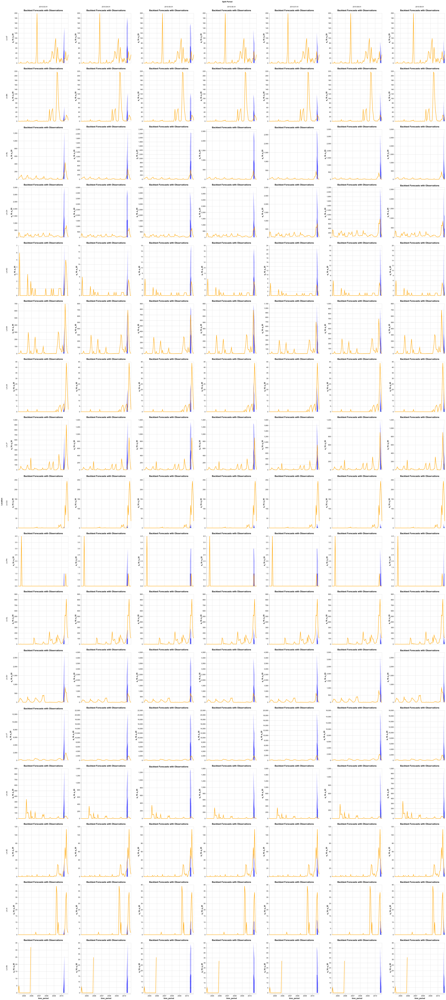

# Batch 12 — route A on chapkit 2.1.2: the route, and what it costs a human

Generated from [[26-09-21_chapModelIntegrationRoutes]] — iteration 3, route A only

`chapkit_ghr_model` at commit `a9532c7` (service version 0.1.2), run as a chapkit model
service through `chap-core` 2.3.1 resolving `chapkit` 2.1.2 (`Archive/platform-chap-it3/`).
A fresh agent on the plan's §4 brief took the route from a machine with no route A image and
an empty Docker build cache to a CHAP evaluation on the Lao admin-1 monthly data, logging as
it went. Batch 10's human-cost model, with every rate unchanged, then priced the route for
the same two personas.

Agent counts: `analysis/09_routeA_iteration3/03_versusIteration2/results/effort_normalised.tsv`.
Human figures: `analysis/09_routeA_iteration3/02_humanCost/results/`. Scores: the files CHAP
wrote.

---

## (a) What had to be read

**Twelve resources, eleven of them used.** Three belong to the model:
- the README
- the Makefile, both compose files, the Dockerfile, `pyproject.toml` and the repository's `CLAUDE.md`
- `main.py` and the image-publishing workflow

Two are CHAP's own `--help` (`chap eval`, and `plot-backtest` with `export-metrics`). Three
are the log specification, the node's claim, and the data files. Three are chap-core
documentation pages at the tag matching the installed CLI, `v2.3.1`:

| Page | What it carries |
|---|---|
| `docs/chap-cli/eval-reference.md` | the service-URL form of `chap eval`; **the GeoJSON is found by sitting beside the CSV with the same stem**, and its ids must match `location` |
| `docs/chap-cli/evaluation-workflow.md` | `chap eval`, then `chap plot-backtest`, then `chap export-metrics` |
| `docs/external_models/chapkit.md` | `docker run -p PORT:8000 <image>`, then `chap eval --model-name http://localhost:PORT --run-config.is-chapkit-model --plot`, on the same public Lao CSV |

The one discard was chap-core's repository README, which is an overview. **No installed
library source was opened.** The model's README still never mentions `chap eval`: it is
written from the chapkit side of the boundary, and everything on the CHAP side comes from
CHAP.

## (b) The process of finding out

**No command failed, no blocker was hit, and there were no dead ends.** Nine commands and six
decisions lie inside the discovery window, which runs to the first `evaluation_complete`.

The decision that shaped the route came early. The image-publishing workflow tags every image
`sha-<commit>`. The agent checked for `ghcr.io/chap-models/chapkit_ghr_model:sha-a9532c7`,
found an amd64 manifest, and chose it over building the Dockerfile. **The image pulls
anonymously.** Keeping the build as a fallback, it never needed it.

The host is arm64 and the image is amd64-only. That was a known condition rather than a
blocker: the README says so, the pull and run take `--platform linux/amd64`, and the model
runs under emulation throughout.

Elapsed to evaluation: **22.8 minutes**, from a fully cold Docker state. Most of that is the
machine:
- up to 14.2 minutes of image pull (849 s, bounded by the log; the agent worked in parallel)
- 5.7 minutes of evaluation (341 s, `evaluation_started` to `evaluation_complete`)

The agent's run as a whole took 139,417 tokens, 59 tool calls and 37.6 minutes. That total
includes about 12 minutes of it waiting on its own clean-shell verification
(`01_discovery/results/agent_usage.tsv`).

## (c) The working invocation

```
docker pull --platform linux/amd64 ghcr.io/chap-models/chapkit_ghr_model:sha-a9532c7
docker run -d --platform linux/amd64 -p 8765:8000 ghcr.io/chap-models/chapkit_ghr_model:sha-a9532c7
chap eval --model-name http://localhost:8765 --dataset-csv chap_LAO_admin1_monthly.csv \
     --output-file eval.nc --run-config.is-chapkit-model --plot
chap plot-backtest --input-file eval.nc --output-file evaluation_plot.html
chap export-metrics --input-files eval.nc --output-file metrics.csv
```

The CSV and the GeoJSON sit side by side with the same stem. All CHAP defaults were taken: 7
splits, 3 prediction periods, stride 1, one training. The model ran on its own default
configuration. The service's `/api/v1/info` confirms what ran: `git_revision a9532c7`,
version 0.1.2, chapkit 2.1.2.

`chap eval` alone writes only `eval.nc`. The figure needs `--plot` (off by default) or
`chap plot-backtest`, and the metrics need `chap export-metrics`.

**The recipe is verified.** The agent removed the pulled image, ran
`scripts/run_route.sh` from `/tmp` under `env -i HOME=$HOME PATH=/usr/bin:/bin`, and it
exited 0 after about 12 minutes. Along the way it:
- fetched the data from the public repository, byte-identical to the archive
- validated the data
- pulled the image
- ran the evaluation, both plots and the metrics
- left no container behind

Two branches did not run:
- its `uv` install of chap-core, for a host without `chap`
- a data fetch from the pinned commit (it fetches from a branch; `DATA_DIR` pins it to the archive)

**Not in the way, but not right either:**
- CHAP warns that `rainfall` and `mean_temperature` are "not used by the model". The service
  log shows the fitted formula uses both, `rainfall.rsum3.l1` and
  `mean_temperature.rmean3.l1`, beside the `bym2` spatial term.
- `--run-config.log-file` writes no file.
- `LA-VI` is dropped with a log warning only.
- `metrics.csv` names the model by its URL.

## (d) What the evaluation reported

17 of 18 locations: CHAP drops `LA-VI`, which has no target values.

| | CRPS | MAE | RMSE | coverage 10–90 |
|---|---|---|---|---|
| by hand during discovery (`results/manual_run/metrics.csv`) | 151.36 | 128.64 | 251.71 | 0.815 |
| by the route script (`results/route_run/metrics.csv`) | 151.03 | 125.57 | 241.52 | 0.818 |

R-INLA is not bit-reproducible and CHAP offers no seed for a chapkit service, so the two runs
bound a spread rather than giving one number.



*CHAP's default `plot-backtest` figure: forecast bands over observed cases, per location and
split. The page is `results/manual_run/evaluation_plot.html`; the 9457 plotted rows are in
`evaluation_plot.tsv` beside it.*

---

## (e) What it would cost a human

**None of these minutes were measured on a person.** What is measured is the route's act
sequence, the documents' lengths and the machine's waits. The per-act pace, what each persona
knows, and the divergence rules are authored. They are batch 10's, unchanged, and the node's
run script refuses to run if they are not.

The personas are batch 10's:
- **the engineer** — a few years past a CS degree, fluent with Docker and software engineering
- **the statistician** — basic programming, no advanced software engineering

| | Expected | Low–high | Machine | Learning | Diagnosing | Not following instructions |
|---|---|---|---|---|---|---|
| **Engineer** | **110 min** | 72–216 | 11.2 | 11.8 | 0 | 12 % |
| **Statistician** | **436 min** | 243–1026 | 11.2 | 188.5 | 0 | 44 % |

These are **complete totals**. The image pull (5.5 minutes, from the clean-shell run) is inside
them, and nothing is excluded. If a person's first pull ran as slowly as the discovery run's
did, add up to 8.6 minutes to both.

**Engineer.** Nothing on the path stops them. The time goes almost entirely on reading:
- the model README, 2833 words — 32 minutes
- CHAP's three documentation pages — 18 minutes
- the repository's build and publish files — 14 minutes

The only partial knowledge charged is CPU architecture and GeoJSON, about 12 minutes between
them.

**Statistician.** Nothing on the path is a failure to diagnose either. What remains is that
route A asks them to learn five things before it will run:

| Prerequisite | First needed at | Expected learning |
|---|---|---|
| Docker — install it, run a container, map a port | step 1, before anything | 90 |
| amd64 against arm64, and emulation | reading the README | 35 |
| compose files | the repository's own tooling | 20 |
| a model as a *running service* CHAP talks to over HTTP | `chap eval --help` | 20 |
| image registries | the repository's own tooling | 15 |

That is 180 of their 436 minutes. The rest is reading at a statistician's pace through
material written for someone who already has containers. One rule changes their path: a
persona who does not read a model's own source skips `main.py` and the publishing workflow,
and uses the image tag the compose file names (`D4`, `scripts/inputs/divergences.tsv`).

**The persona still matters more than anything else.** The statistician's estimate is 4.0×
the engineer's. The whole of the difference is prerequisites the route assumes, and none of
it is trouble on the route.

## Where the detail is

| For | Go to |
|---|---|
| The contemporaneous log, the agent's narrative, the brief it was given | `analysis/09_routeA_iteration3/01_discovery/results/` |
| Both evaluations, with every file CHAP wrote | `…/01_discovery/results/manual_run/`, `…/route_run/` |
| The route script, verified in a clean shell | `…/01_discovery/scripts/run_route.sh` |
| Every human step, per persona, with its gate and band | `…/02_humanCost/results/walkthrough_<persona>_route-a-it3.tsv` |
| The measured inputs | `…/02_humanCost/results/doc_sizes.tsv`, `machine_waits.tsv` |
| The step mapping and the divergence rule | `…/02_humanCost/scripts/inputs/steps.tsv`, `divergences.tsv` |
| The re-pinned model and platform | `Archive/model-route-a-it3/`, `Archive/platform-chap-it3/`, `Archive/chapcore-docs-v2.3.1/` |
