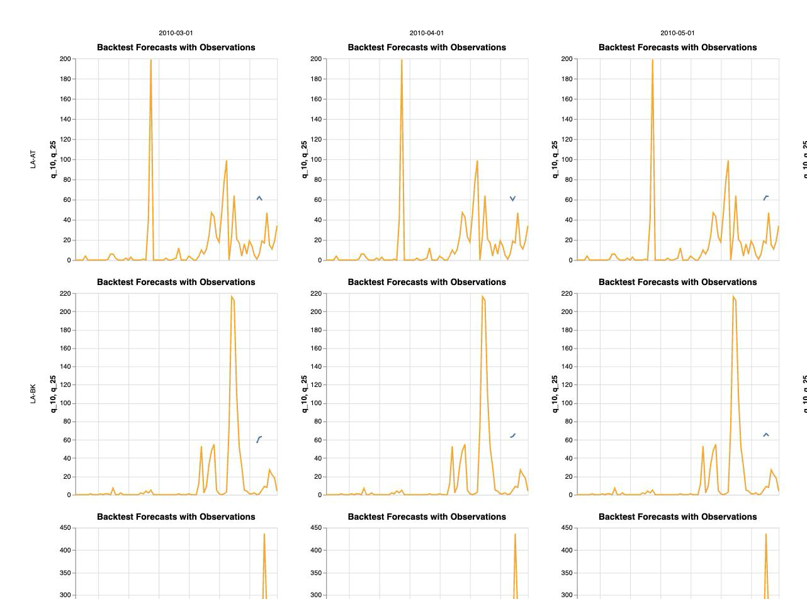

# Running a model through CHAP: chapkit or MLproject — overview

Generated from [[26-09-21_chapModelIntegrationRoutes]] — iteration 2

**Version 1.** The single entry point to this project: what was asked, what was done, what came
out, and where to look for the detail behind any of it.

> **This version will be superseded rather than edited.** It covers the work through batch 7:
> both routes discovered, run, re-run from clean, and compared. Still to come — the claim
> collection and the three validation passes, and the human's decision on two undeclared
> licences.

Every number below is read from a file in the analysis tree, and each section names the file.

---

## The question

CHAP evaluates climate–health prediction models. A model can be integrated with it in two quite
different ways, and this project asks **how hard each one is to actually get running**:

- **Route A — a chapkit model service.** The model is a containerised REST service that CHAP
  talks to over HTTP. Represented here by `chap-models/chapkit_ghr_model`, a Bayesian
  spatio-temporal model built on R-INLA.
- **Route B — an `MLproject` model.** The model is a directory with an `MLproject` file
  declaring how to train and predict. Represented here by `dhis2-chap/minimalist_example_uv`,
  a deliberately minimal linear regression.

Each was taken down its route by a **separate agent that knew nothing of the other**, working
from identical instructions and public material only, until it produced a CHAP evaluation on
the same public Lao data. Each agent logged every documentation source it opened, every command
it ran and every dead end it hit, at the moment it happened.

The object of study is the **route**, not the prediction. The two models are not competitors
and their scores are never compared against each other.

## The short answer

**Both routes run, both models ran as published, and route A is consistently the more expensive
of the two without being difficult.**

1. **Both produce a CHAP evaluation, repeatably.** Re-run from clean, route A completed 4 times
   out of 4 and route B 2 out of 2. Neither has failed once.
2. **Neither model was modified and nothing was interposed.** Route A's chapkit service is
   handed straight to `chap eval` with `--run-config.is-chapkit-model`.
3. **Route A costs more on every effort statistic that orders** — 5 sources to 4, 11 commands
   to 9, 3 dead ends to 2, 13.0 minutes to a written evaluation against 4.8.
4. **The one difference of kind is the prerequisite.** Route A needs a container runtime, an
   image build and a container registry. Route B needs none of the three.
5. **Neither route's answer was fully available from public documentation.** Both agents had to
   read the installed `chap-core` source to finish. That cost is CHAP's, and it is the same on
   both sides.

## What was actually run

| | Pinned to |
|---|---|
| Platform | CHAP, `chap-core` **2.3.1**, resolving `chapkit` **2.1.0** and `servicekit` **2.0.2**; installed as a `uv` tool, with a 176-package freeze archived |
| Route A model | `chap-models/chapkit_ghr_model` @ `60b16a2`, GPL-3.0 |
| Route B model | `dhis2-chap/minimalist_example_uv` @ `5cd8a12`, **no licence declared** |
| Data | `dhis2/climate-health-data`, `lao/` @ `af362d5`, **no licence declared** |

Three versions are pinned for the platform where one would be the obvious choice. A chapkit
model service negotiates with `chapkit`, and `chap-core`'s version does not determine which
`chapkit` sits behind it — across released versions that requirement has been unbounded above
in one and capped below 2 in others. A pin naming only `chap-core` would be ambiguous in
exactly the place the two routes differ.

The data is an **18-unit, 156-month admin-1 panel for Laos, 1998-01 to 2010-12, 2808 rows**.
Target `disease_cases` (dengue, OpenDengue); covariates rainfall, mean temperature, mean
relative humidity, population. 233 rows have no target value.
*(`analysis/01_anchors/results/lao_characterisation.tsv`)*

Three inconsistencies in the published data were **recorded and deliberately not repaired** —
the schema's row count is of target-present rows rather than rows, the schema names a boundary
file that was renamed upstream, and the target has gaps. How each route copes with them is part
of what was being observed.

---

## Run it yourself

Each route's verified artefact is its `run_route.sh`, which assumes nothing but a shell, `git`,
`curl` and — for route A — a running Docker daemon. Each was **run end to end in a clean shell**
under `env -i`, with every inherited variable stripped. The blocks below are the essential path
through those scripts, for reading and pasting; the scripts themselves are the tested thing and
handle the waiting, the checking and the cleanup.

### Route A — chapkit service

*(full script: `analysis/02_routeA_chapkit/scripts/run_route.sh`)*

```bash
# Needs: git, curl, a running Docker daemon.
uv tool install chap-core==2.3.1          # if you do not already have `chap`

mkdir -p chap-routeA && cd chap-routeA

# 1. The data. The GeoJSON is never named on a command line: CHAP finds it by
#    matching the CSV's stem in the same directory, so these two must sit together.
git clone --depth 1 https://github.com/dhis2/climate-health-data
mkdir -p run
cp climate-health-data/lao/chap_LAO_admin1_monthly.csv     run/
cp climate-health-data/lao/chap_LAO_admin1_monthly.geojson run/

# 2. The model. The published GHCR image is NOT anonymously pullable (401), so
#    build the Dockerfile. --platform linux/amd64 is mandatory: R-INLA ships
#    x86_64 binaries only, so an arm64 host runs this under emulation.
git clone --depth 1 https://github.com/chap-models/chapkit_ghr_model model
docker build --platform linux/amd64 \
    --build-arg GIT_REVISION="$(git -C model rev-parse HEAD)" \
    -t chapkit-ghr-model:latest model

docker run -d --platform linux/amd64 -p 8000:8000 --name ghr chapkit-ghr-model:latest
until curl -fsS http://localhost:8000/health >/dev/null 2>&1; do sleep 3; done

# 3. The evaluation. CHAP takes the service URL where a model name would go.
cd run
chap eval http://localhost:8000 chap_LAO_admin1_monthly.csv evaluation.nc \
    --run-config.is-chapkit-model --plot

# `chap eval` writes a file, not an answer. --input-files is variadic, so both
# paths must be passed as named flags; positional arguments fail.
chap export-metrics --input-files evaluation.nc --output-file metrics.csv

docker rm -f ghr
```

Expect roughly **6 minutes** for the evaluation on an arm64 host under emulation, plus the image
build. A cold build clones a third-party GitLab dependency and compiles it from source alongside
two CRAN installs, and takes considerably longer — see the caveat below.

### Route B — `MLproject` directory

*(full script: `analysis/03_routeB_mlproject/scripts/run_route.sh`)*

```bash
# Needs: git, curl. Everything else installs itself. No container, ever.
curl -LsSf https://astral.sh/uv/install.sh | sh     # if you do not already have uv
export PATH="$HOME/.local/bin:$PATH"
uv tool install chap-core==2.3.1

mkdir -p chap-routeB && cd chap-routeB

# 1. The data — same convention: CSV and GeoJSON side by side, same stem.
git clone --depth 1 https://github.com/dhis2/climate-health-data
mkdir -p run
cp climate-health-data/lao/chap_LAO_admin1_monthly.csv     run/
cp climate-health-data/lao/chap_LAO_admin1_monthly.geojson run/

# 2. The model. Nothing is built: its MLproject declares `uv_env: pyproject.toml`,
#    so CHAP runs train/predict through uv on the host.
git clone https://github.com/dhis2-chap/minimalist_example_uv
cd minimalist_example_uv

# 3. The evaluation, from inside the model directory.
chap eval --model-name . \
    --dataset-csv ../run/chap_LAO_admin1_monthly.csv \
    --output-file ../run/eval.nc --plot

chap export-metrics --input-files ../run/eval.nc --output-file ../run/metrics.csv
```

Expect about **50 seconds** end to end.

> **Do not run `chap sanity-check-model --model-url .` without `--dataset-path`.** On a clean
> chap-core 2.3.1 it dies with `FileNotFoundError: …/site-packages/example_data/hydromet_5_filtered.csv`
> — it defaults to a bundled dataset the wheel does not ship. Passing `--dataset-path` with your
> own CSV sidesteps it.

---

## What the evaluations look like

`chap eval --plot` draws a **backtest grid**: observed cases as a line, the model's forecast as
10–90 and 25–75 quantile bands, one panel per admin unit per backtest split. The plot is **off
by default** and appears only if `--plot` is passed. The rasters below are viewport captures of
the first two units across the first three splits; the linked HTML is the complete figure, all
17 units and all 7 splits.

### Route A — `chapkit_ghr_model`


- **Full evaluation figure**: [`analysis/02_routeA_chapkit/results/eval/evaluation.html`](../../analysis/02_routeA_chapkit/results/eval/evaluation.html)
- Metrics: [`metrics.csv`](../../analysis/02_routeA_chapkit/results/eval/metrics.csv) · raw evaluation: `evaluation.nc` · the 9520 plotted rows: `evaluation_plot.tsv`

### Route B — `minimalist_example_uv`



- **Full evaluation figure**: [`analysis/03_routeB_mlproject/results/eval/eval.html`](../../analysis/03_routeB_mlproject/results/eval/eval.html)
- Metrics: [`metrics.csv`](../../analysis/03_routeB_mlproject/results/eval/metrics.csv) · raw evaluation: `eval.nc` · the 9520 plotted rows: `evaluation_plot.tsv`

**The visible difference between the two figures is a property of the models, not of the
routes.** Route A's forecast is a band; route B's is a bare mark, because that model emits a
single deterministic sample — `q_10` through `q_90` are the same number in all 9520 plotted
rows. That is also why its CRPS equals its MAE to the last digit and both its coverage figures
are zero: a point prediction has no spread for an interval to cover.

### What each evaluation reported

*(`analysis/04_comparison/results/comparison_table.tsv`)* Both cover **17 of 18 units** — CHAP
drops `LA-VI`, which has no target values — on CHAP's defaults: 7 splits, 3-period horizon, one
retrain, `climatology` future weather.

| Metric | Route A | Route B |
|---|---|---|
| MAE | 126.07 | 171.96 |
| RMSE | 242.77 | 358.93 |
| CRPS | 150.25 | 171.96 |
| MAPE | 150.80 | 383.16 |
| Coverage 10–90 | 0.82 | 0.00 |

**These two columns are reported per route and are not compared.** They are two different models
fitted by different methods. The plan's §2 forbids a cross-route performance claim, and putting
two columns of metrics side by side is the surest way to make one by accident.

---

## Does each route run again, from clean?

*(`analysis/05_repeatability/results/completion.tsv`, `score_spread.tsv`)*

| | Route A | Route B |
|---|---|---|
| Runs found, all completing | **4 of 4** | **2 of 2** |
| Distinct results | 4 | 1 |
| Bit-reproducible | no | **yes** |
| Widest spread across runs | 3.4 % (RMSE) | 0.00 % |

Route A's scores move by 0.45–3.4 % between identical invocations, because it fits with R-INLA,
which its own README states is not bit-reproducible; nothing in the route sets a seed and CHAP
offers none for a chapkit service. Route B's do not move at all. **This is a property of the two
models' inference methods, not of the two integration mechanisms**, and it is reported rather
than corrected for: a route whose numbers shift a few per cent is a working route. The practical
consequence is only that route A's scores should not be quoted beyond three significant figures.

## How hard was each to get running?

*(`analysis/04_comparison/results/comparison_table.tsv`)*

| | Route A | Route B |
|---|---|---|
| Information sources consulted | 5 | 4 |
| …that contributed | 5 | 4 |
| Commands run | 11 | 9 |
| …that failed | 1 | 1 |
| Blockers hit / left unresolved | 2 / **1** | 1 / 0 |
| **Dead ends** | **3** | **2** |
| Minutes to a written evaluation | 13.0 | 4.8 |
| Needs a container runtime / build / registry | yes / yes / yes | **no / no / no** |

The ratios sit between 1.2 and 2.7. Route A is harder, but not in the way a broken route is
harder.

**Route A's largest single cost belongs to its model rather than to its route.** The image is
amd64-only because R-INLA ships x86_64 binaries, so on an arm64 host it runs under emulation
throughout — the one blocker hit and never resolved. A chapkit model without a compiled
statistical backend would not pay it.

**What *is* attributable to the mechanism** is the prerequisite surface: serving a model over
HTTP means an image has to be built, shipped and run. An `MLproject` model has no such surface.

### One measurement problem, handled in the open

Taken at face value, route A has **zero** failed commands and route B has one — which is
backwards. Route A's agent marked two commands `ok` before reading their output, recorded the
failures in later rows, and logged its own decision not to rewrite them.

Rather than edit a log, that became an **alternatives node** (`analysis/04_comparison/01_effort/`).
`a_asLogged` takes each log at face value and is the only purely observational reading;
`b_normalised` is the main path and applies two rules to both logs alike — attribute a failure to
the command that failed wherever the agent recorded it, and count only up to the moment the route
first worked. Everything the rules touched is written to `what_the_rules_changed.md`. Both
readings order the routes identically; normalisation narrows the gap and reverses nothing. Both
stay runnable.

## What is true of CHAP regardless of route

Three things turned up **independently in both logs**, written by agents that never
communicated, which is what makes them findings about the platform rather than about a route:

1. **The GeoJSON has no command-line flag.** CHAP finds polygons by matching the CSV's stem in
   the same directory (`chap_core.cli_endpoints._common.discover_geojson`). Both agents
   established this by reading installed source. Rename or move the CSV alone and you silently
   lose the geometry.
2. **`chap eval` writes a file, not an answer.** Metrics need a separate `chap export-metrics`,
   and the default figure appears only with `--plot`. Neither model's README mentions either.
3. **One admin unit is silently dropped.** `LA-VI` has no target values, so both evaluations
   cover 17 of 18 units — announced in a warning inside a long log.

And one defect worth reporting upstream: `chap sanity-check-model` crashes on a clean chap-core
2.3.1 because it defaults to a bundled dataset the wheel does not ship.

## What this cannot tell you

- **Each route is one model, one agent, one machine.** Route A's costs — the amd64-only image,
  the build, the registry that refuses anonymous pulls — belong to *this* model as much as to
  the chapkit mechanism.
- **The build-time figures are not cold-build figures.** The host's Docker layer cache was
  already warm before the work began and stayed warm on every re-run, so the expensive path was
  never exercised. Deleting the model's image was not enough — the layer cache survives it. A
  genuinely cold measurement needs `docker builder prune -a` first.
- **One branch of each recipe went unverified**, and both are recorded: route A's cold container
  build, and route B's `uv` self-install, which was not run because it would have upgraded the
  host's `uv` as a side effect.
- **A single failed command on each side is a thin basis for a ratio.** The honest form of the
  conclusion is directional.

## Where to look next

| If you want | Go to |
|---|---|
| What the project is, its anchors, current status | `readme-at-start.md` |
| The aim, non-negotiables, batch ledger, and every judgment call with who made it | `Human-input/Plans for AI generation/26-09-21_chapModelIntegrationRoutes.md` (§4b is the decision log) |
| How the two agents were kept independent | `AI-generated/batch-reports/26-09-22_b03b04_routesDiscovered.md` |
| Each route in full — resources, process, invocation, results | `AI-generated/batch-reports/26-09-22_b05_routeReports.md` |
| The route-by-route comparison in detail | `AI-generated/batch-reports/26-09-22_b06_comparativeReport.md` |
| What each agent actually did, minute by minute, in its own words | `analysis/0{2,3}_route*/results/discovery_notes.md` and `discovery_log.tsv` |
| To re-run a route yourself | `analysis/0{2,3}_route*/scripts/run_route.sh` |
| To reproduce the whole analysis | `analysis/run.sh` — about 7 minutes, both routes end to end |

## Open for the human

1. **Two anchors declare no licence** — `minimalist_example_uv` and `dhis2/climate-health-data`.
   Redistribution of the archived copies is not established. This blocks release, not analysis.
2. **`origin` points at the starting-point template repository**, `sandvelab/agentic-model-development-start`,
   and this branch is ahead of it. Nothing has been pushed. It wants either removing or
   repointing at a repository for this project.
3. **`.claude/settings.json` still holds `<PARENT_DIR>` and `<HOME>` placeholders.** Until they
   are real paths, a parent directory's `CLAUDE.md` can reach this project's instructions, which
   the set-up guide exists to prevent.
4. **Whether the two CHAP defects are worth reporting upstream** — `sanity-check-model`'s missing
   bundled dataset, and `export-metrics` silently failing on positional arguments.
