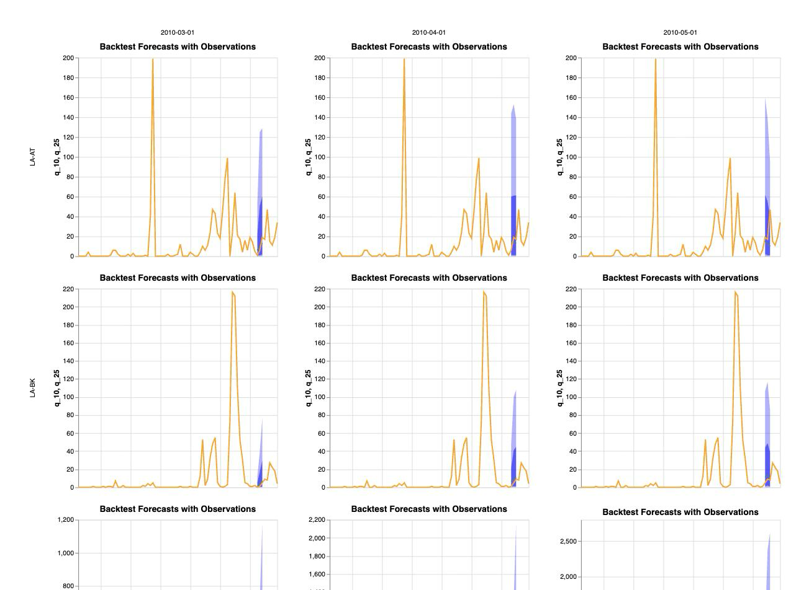

# Running a model through CHAP: chapkit or MLproject

Generated from [[26-09-21_chapModelIntegrationRoutes]] — iteration 2

**Version 5 — executive.** The single entry point. Detail is in the appendix at the foot; every
number here is read from a named file. Earlier versions are kept unchanged.

---

## Bottom line

**Both routes reach a CHAP evaluation and both models run as published. The difference that
matters is not effort — it is that on the chapkit route a documented feature is broken in
silence.**

### 1. You cannot configure a chapkit model through CHAP, and nothing tells you

Route A's model declares **eighteen** options — spatial, seasonal and interannual random
effects, likelihood family, priors, lags, rolling windows. `chap eval --model-configuration-yaml`
accepts your values, the service returns **HTTP 201**, and the model fits its **defaults**. The
run completes, writes a valid NetCDF, exports real metrics and draws a real plot. There is no
error, no warning, and no field in the output that differs from a correctly configured run.

chap-core will only send values **nested** under `user_option_values`; the service only honours a
**flat** mapping. The one shape CHAP sends is the one the model discards.

### 2. The same thing on an `MLproject` model works — and when it goes wrong it stops

| | Declares options | Settable through `chap eval`? |
|---|---|---|
| Route A — `chapkit_ghr_model` | **18** | **No** — accepted, stored, silently discarded |
| Route B — `minimalist_example_uv` | 0 | n/a — nothing to set |
| Case C — `zlilu/minimal_template_example` | 1 (`alpha`) | **Yes** — three values asked, three delivered, predictions changed |

Both mechanisms can disagree with a model about a configuration's shape. **They fail completely
differently**, and this is the study's sharpest result:

| | chapkit (route A) | `MLproject` (case C) |
|---|---|---|
| What happens | HTTP 201; defaults applied; model fits them | run halts |
| What you get | a valid NetCDF, real metrics, a real plot | nothing |
| What you are told | **nothing** | the failing command and `AttributeError` |

A stopped run with a named cause costs an operator minutes. A completed run from a configuration
that was never applied costs them whatever they go on to conclude from it.

### 3. Route A costs about twice as much to get running

| | Route A — chapkit | Route B — MLproject |
|---|---|---|
| Reached a CHAP evaluation | yes | yes |
| Runs again from clean | 4 of 4 | 2 of 2 |
| Sources read / commands run / dead ends | 5 / 11 / **3** | 4 / 9 / **2** |
| Minutes to a written evaluation | 13.0 | 4.8 |
| Container runtime · image build · registry | **yes · yes · yes** | no · no · no |

Route A's largest single cost belongs to its *model*, not its route: the image is amd64-only
because R-INLA ships x86_64 binaries, so on an arm64 host it runs under emulation throughout.
What is attributable to the *mechanism* is the surface area — **8 distinct chapkit endpoints,
called 198 times in one evaluation**, each a payload two independently versioned packages must
agree on. An `MLproject` model has no negotiated payload at all.

## How you run each — in full

**Route A.** Needs git, curl, a running Docker daemon. About 6 min plus the image build.

```bash
uv tool install chap-core==2.3.1
mkdir -p chap-routeA && cd chap-routeA
git clone --depth 1 https://github.com/dhis2/climate-health-data
mkdir -p run && cp climate-health-data/lao/chap_LAO_admin1_monthly.{csv,geojson} run/

# The published GHCR image is NOT anonymously pullable (401), so build the Dockerfile.
# --platform linux/amd64 is mandatory: R-INLA ships x86_64 binaries only.
git clone --depth 1 https://github.com/chap-models/chapkit_ghr_model model
docker build --platform linux/amd64 \
    --build-arg GIT_REVISION="$(git -C model rev-parse HEAD)" \
    -t chapkit-ghr-model:latest model
docker run -d --platform linux/amd64 -p 8000:8000 --name ghr chapkit-ghr-model:latest
until curl -fsS http://localhost:8000/health >/dev/null 2>&1; do sleep 3; done

cd run
chap eval http://localhost:8000 chap_LAO_admin1_monthly.csv evaluation.nc \
    --run-config.is-chapkit-model --plot
chap export-metrics --input-files evaluation.nc --output-file metrics.csv
docker rm -f ghr
```

**Route B.** Needs git and curl. Everything else installs itself. About 50 seconds.

```bash
curl -LsSf https://astral.sh/uv/install.sh | sh
export PATH="$HOME/.local/bin:$PATH"
uv tool install chap-core==2.3.1
mkdir -p chap-routeB && cd chap-routeB
git clone --depth 1 https://github.com/dhis2/climate-health-data
mkdir -p run && cp climate-health-data/lao/chap_LAO_admin1_monthly.{csv,geojson} run/

git clone https://github.com/dhis2-chap/minimalist_example_uv
cd minimalist_example_uv
chap eval --model-name . \
    --dataset-csv ../run/chap_LAO_admin1_monthly.csv \
    --output-file ../run/eval.nc --plot
chap export-metrics --input-files ../run/eval.nc --output-file ../run/metrics.csv
```

Three traps, both routes: the **GeoJSON is never named on a command line** (CHAP matches the
CSV's stem in the same directory); **`chap eval` writes a file, not an answer** (`--plot` is off
by default, metrics need `export-metrics`); and **`--input-files` is variadic**, so positional
arguments to `export-metrics` fail silently-ish.

## Configuration, in detail

**`MLproject` — one file, one writer, one reader.** A template declares `user_options` in its
`MLproject` file, which sits in the repository and can be read without running anything. The
operator passes `--model-configuration-yaml`; chap-core writes the whole configuration into
`model_configuration_for_run.yaml` in the run directory, beside the data; the model's own script
reads it. Nothing is negotiated, because there is no second party. Case C proves it end to end:
`alpha` of 1e-5, 1e2 and 1e5 each arrive in that file and each produces a different evaluation
(MAE 171.9631, 171.9640, 174.5322). Nothing was interposed.

**chapkit — two conventions that do not meet.** A chapkit model advertises a JSON schema at
`/api/v1/configs/$schema`, readable only by building and starting the container. chap-core reads
it and POSTs a configuration **nested** under `user_option_values`. The service stores a **flat**
mapping: handed the nested one it returns **HTTP 201**, fills every option from its defaults, and
fits with them. The one shape CHAP will send is the one the model discards, and **nothing reports
it** — the run completes, writes a valid NetCDF, exports real metrics and draws a real plot.

**GHRmodel itself is not the problem.** `chapkit_ghr_model` is the best-documented artefact in
this study: its README carries a table of all 18 options with the R-INLA latent models explained
and the encoding spelled out, and the repository ships `example_data/config.yml` whose own
comment says it is *"in the flat layout chapkit's ShellModelRunner writes"*. The model documents
its configuration thoroughly and implements chapkit's **file** convention correctly. What is
undiscoverable is that chap-core's **REST** bridge does not deliver it.

**Where the loud/quiet split comes from.** Agreement is validated at `/api/v1/info`, so a
mismatch there fails loudly; it is not validated at `/api/v1/configs`, so a mismatch there fails
silently. The same boundary has two failure modes, and the quiet one is the dangerous one. The
`MLproject` failure in case C came from CHAP's own `chap model schema --example`, which emits a
bare scalar where that model reads `alpha.values`.

## What came out

**Each route's evaluation**, 17 of 18 units (CHAP drops `LA-VI`, which has no target), CHAP
defaults throughout. **Reported per route and never compared** — two different models, different
methods; the plan's §2 forbids a cross-route performance claim.

| | Route A | Route B |
|---|---|---|
| MAE · RMSE · CRPS | 126.07 · 242.77 · 150.25 | 171.96 · 358.93 · 171.96 |
| Coverage 10–90 | 0.82 | **0.00** |
| Spread across re-runs | 0.45–3.4 % | 0 % (bit-identical) |

Route B's zero coverage is the model, not the route: it emits a single deterministic sample, so
`q_10` through `q_90` are the same number in all 9520 plotted rows — which is why its CRPS
equals its MAE exactly, and why its forecast renders as a mark where route A's is a band.



**Configuration changes the answer far more than noise does.** Five runs through an interposed
proxy, one option changed at a time from the published defaults, against a measured noise floor
of 2.2 % MAE / 3.4 % RMSE:

| Variant | MAE (vs control) | Coverage 10–90 |
|---|---|---|
| published defaults | 126.42 | 0.821 |
| `re_spatial: none` | 166.51 (+31.7 %) | 0.819 |
| `re_seasonal: rw2` | 124.03 (−1.9 %, **inside noise**) | 0.821 |
| `re_interannual: rw1` | 134.47 (+6.4 %) | 0.830 |
| `family: poisson` | 105.47 (**−16.6 %**) | **0.238** |

Two readings matter more than the ranking. Dropping the spatial term moves MAE and CRPS in
**opposite directions**, so which metric you consult flips the sign of the answer. And
`poisson` has the best MAE, RMSE and CRPS of all five while its coverage collapses to 0.24 —
selecting on point accuracy would pick the model whose uncertainty is worthless.

**No configuration is chosen or recommended.** The plan's §3 stops this project if a batch
selects between configurations on Lao scores, with nothing held out to catch it.

## Open for the human

1. **Two anchors declare no licence** — `minimalist_example_uv` and `dhis2/climate-health-data`.
   Blocks release, not analysis.
2. **`origin` points at the starting-point template repository**, branch ahead of it, nothing
   pushed.
3. **`.claude/settings.json` still holds `<PARENT_DIR>` and `<HOME>` placeholders.**
4. **Three defects look worth reporting upstream** — the silently discarded model configuration
   (most serious), `chap sanity-check-model` crashing on a clean install, and `export-metrics`
   failing on positional arguments.

---

## Appendix — where the detail is

| For | Go to |
|---|---|
| Configuration, the variant sweep, and the CHAP/chapkit boundary in full | `AI-generated/batch-reports/26-09-23_b08b_configurability.md` |
| The third case, and how the two mechanisms fail differently | `AI-generated/batch-reports/26-09-23_b08c_thirdCase.md` |
| Each route in full — resources, process, invocation, results | `AI-generated/batch-reports/26-09-22_b05_routeReports.md` |
| The route-by-route comparison | `AI-generated/batch-reports/26-09-22_b06_comparativeReport.md` |
| How the two discovering agents were kept independent | `AI-generated/batch-reports/26-09-22_b03b04_routesDiscovered.md` |
| The anchors and the Lao dataset | `AI-generated/batch-reports/26-09-22_b01_anchors.md` |
| What each agent did, minute by minute, in its own words | `analysis/0{2,3}_route*/results/discovery_notes.md` |
| The raw effort logs and both readings of them | `analysis/04_comparison/01_effort/` |
| Variant results, fitted formulas, contract surface | `analysis/06_configurability/results/` |
| Configuration delivery on the third case | `analysis/07_configurableMLproject/results/` |
| Repeatability across every run | `analysis/05_repeatability/results/` |
| The aim, non-negotiables, ledger, every judgment call with its agency | `Human-input/Plans for AI generation/26-09-21_chapModelIntegrationRoutes.md` (§4b) |
| To re-run a route yourself | `analysis/0{2,3}_route*/scripts/run_route.sh` |
| To reproduce everything | `analysis/run.sh` — about 40 minutes |
